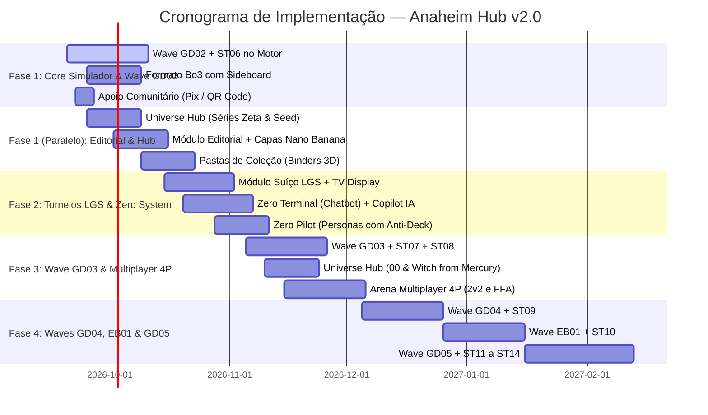

# Documento de Arquitetura e Plano Mestre — Evolução do Sistema & Zero System (v2.0)

> **Documento Canônico de Planejamento de Ciclos Futuros**  
> Data de Revisão: 2026-09-16 | Arquiteto & Engenheiro de Software: Willen, Antigravity & Claude CLI  
> Status: Aprovado Estrategicamente & Pronto para Execução Paralela  
> Referências: [docs/MANUAL_DESENVOLVIMENTO.md](MANUAL_DESENVOLVIMENTO.md), [AI_GUIDE.md](../AI_GUIDE.md), [PLANEJAMENTO.md](../PLANEJAMENTO.md), [prisma/schema.prisma](../prisma/schema.prisma)

---

## 1. Visão Executiva e Posicionamento do Produto

O **Portal Gundam TCG BR (Anaheim Hub)** consolidou com sucesso seu motor de jogo autoritativo, o catálogo nacional traduzido com terminologia oficial blindada, o deckbuilder analítico, o multiplayer em tempo real via Socket.io e a cobertura de regras até GD01 e ST05.

A versão **2.0** adota como prioridade máxima o **Simulador e o Deckbuilder**, expandindo o motor para cobrir as ondas de lançamentos (**GD02 a GD05 + Starters 06 a 14**), acompanhado da introdução do formato competitivo **Melhor de 3 (Bo3) com Sideboard**, **Multiplayer Real (2v2 / 4P)** e o ousado **ZERO SYSTEM**.

### Arquitetura de Execução Paralela Multi-Agente

Para maximizar a velocidade sem comprometer a estabilidade do motor de regras, o desenvolvimento opera em **worktrees isoladas (`git worktree`)** com especialização clara de agentes:

```
                               ┌────────────────────────────────────────────────────────┐
                               │             ORQUESTRAÇÃO MULTIAGENTE                   │
                               │        Willen (Lead) · Antigravity · Claude CLI        │
                               └──────────────────────────┬─────────────────────────────┘
                                                          │
                    ┌─────────────────────────────────────┴─────────────────────────────────────┐
                    │                                                                           │
       ┌────────────▼────────────┐                                                 ┌────────────▼────────────┐
       │     TERMINAL 1 (Core)   │                                                 │   TERMINAL 2 (Features) │
       │    MOTOR, REGRAS & IA   │                                                 │    FRONTEND & CONTEÚDO  │
       ├─────────────────────────┤                                                 ├─────────────────────────┤
       │ • Agente: Antigravity   │                                                 │ • Agente: Claude CLI    │
       │ • Branch: feature/gd02  │                                                 │ • Branch: feature/hub   │
       │ • Foco: Ingestão GD02,  │                                                 │ • Foco: Universe Hub,   │
       │   Engine, Bo3, Suíço,   │                                                 │   Editorial + Capas,    │
       │   Zero System & MCTS    │                                                 │   Pastas e Social       │
       └─────────────────────────┘                                                 └─────────────────────────┘
```

---

## 2. Pilar 1: Inclusão das Waves de Cartas Novas no Motor de Regras

### 2.1 Mapeamento das Ondas e Coleções

A expansão do motor obedecerá à governança estrita estabelecida no split de GD01 (`docs/MANUAL_DESENVOLVIMENTO.md §3` e `§4.3`), onde cada coleção é isolada em seu respectivo namespace dentro de `src/modules/simulator/content/` por cor e tipo, protegida por gates de cobertura (`deckCoverageGate.ts`) e suítes determinísticas (Golden Master).

| Onda | Coleções | Quantidade de Modelos Únicos | Novas Mecânicas Previstas & Desafios de Motor |
|---|---|---|---|
| **Onda 6 (Prioritária)** | **GD02 + ST06** | ~146 cartas | Auras globais complexas de redução de custo, gatilhos de sacrifício encadeado multi-unidade, efeitos contínuos de Base avançados. |
| **Onda 7** | **GD03 + ST07 + ST08** | ~170 cartas | Mecânicas de contadores/tokens especializados, custos alternativos de Deploy (ex: exílio de recurso), condições de vitória tática. |
| **Onda 8** | **GD04 + ST09** | ~150 cartas | Ejeção de Piloto reativa durante combate, troca de Unidade em campo mantendo o Piloto acoplado (Transform / Mid-battle Swap). |
| **Onda 9** | **EB01 + ST10** | ~95 cartas | Efeitos híbridos de cor dupla avançados, ativações no cemitério (Scrap/Graveyard triggers), restrições dinâmicas de ataque. |
| **Onda 10** | **GD05 + ST11 a ST14** | ~220 cartas | Rotação e formato avançado, regras de temporada oficial Bandai, finalização do ciclo de expansões primárias. |

### 2.2 Protocolo de Engenharia para Novas Cartas

Cada carta segue obrigatoriamente o ciclo canônico de 5 etapas:

1. **Ingestão no Catálogo & RAG Translation**:
   - `scripts/import-card-set.mjs` ingere dados oficiais e gera `CardModel`.
   - `scripts/translate-card-effects.mjs` com RAG de terminologia (`docs/17`) gera `effectPt`, blindando tokens protegidos (`【Deploy】`, `<Blocker>`, `Lv.X`, `AP`, `HP`).
2. **Declaração de `CardDef` e `EffectSpec`**:
   - Fatiamento em `content/<set>/unitsBlue.ts`, `unitsGreen.ts`, `pilots.ts`, etc.
   - Nenhuma primitiva nova é criada sem registro no `primitives-claims.json`.
3. **TDD Atômico por Carta Complexa**:
   - Cartas com condições ou escolhas de alvo ganham testes dedicados em `content/<set>.test.ts`.
4. **Fuzzing Massivo de Self-Play**:
   - Execução de 1.000+ partidas simuladas (`pnpm gundam:fuzz`) garantindo zero loop infinito (`MAX_CASCADE_DEPTH=12`, `MAX_QUEUE_BREADTH=150`) e zero crash de estado.
5. **Atualização do Golden Master**:
   - Hash determinístico registrado com `pnpm gundam:golden:update`.

---

## 3. Pilar 2: O Novo ZERO SYSTEM (Evolução do Veda System)

O atual **Sistema VEDA** atua principalmente como um processador de telemetria estática (Power Rankings e gráficos). O **ZERO SYSTEM** (homenageando a interface tática do *Wing Gundam Zero*) evolui esse ecossistema para uma **IA Tática Multimodal, Multicamada e Hiper-Adaptativa**, suportada por uma arquitetura híbrida de modelos **Google Gemini (1.5 Flash / Pro)** e **Anthropic Claude (3.5 Sonnet / 3.7)**.

### 3.1 Arquitetura dos 5 Núcleos do Zero System

```
                     ┌──────────────────────────────────────────────────────────┐
                     │                       ZERO SYSTEM                        │
                     │          Inteligência Artificial Híbrida (Gemini+Claude) │
                     └─────────────┬──────────────┬──────────────┬──────────────┘
                                   │              │              │              │
           ┌───────────────────────┼──────────────┴──────────────┼──────────────└───────────────────────┐
           ▼                       ▼                             ▼                                      ▼
┌─────────────────────┐ ┌─────────────────────┐       ┌─────────────────────┐        ┌─────────────────────┐
│ 1. ZERO COPILOT     │ │ 2. ZERO COACH       │       │ 3. ZERO PILOT AI    │        │ 4. ZERO FORESIGHT   │
│ Deckbuilder Advisor │ │ In-Game Live HUD    │       │ Bot Multinível (4N) │        │ Previsão de Meta    │
├─────────────────────┤ ├─────────────────────┤       ├─────────────────────┤        ├─────────────────────┤
│ • Sugestões de Tech │ │ • Dicas de Ordem    │       │ N1: Recruta (Heur.) │        │ • Monte Carlo 10k   │
│ • Curva e Hiperg.   │ │ • Chance de Burst   │       │ N2: Ás (MCTS Poda)  │        │ • Simulação de Ban  │
│ • Diagnóstico Meta  │ │ • Alerta de Letal   │       │ N3: Zero Awakening  │        │ • Tier 1 Preditivo  │
│ • Substituições     │ │ • Análise Pós-Jogo  │       │ N4: Personas Piloto │        │   + Dados de Torneio│
└─────────────────────┘ └─────────────────────┘       └──────────┬──────────┘        └─────────────────────┘
                                                                 │
                                                      ┌──────────┴──────────┐
                                                      │ 5. ZERO TERMINAL    │
                                                      │ Chatbot Conversacion│
                                                      ├─────────────────────┤
                                                      │ • Lore & Estratégia │
                                                      │ • Rulings & Dúvidas │
                                                      │ • Atualizações Live │
                                                      └─────────────────────┘
```

#### 1. Zero Copilot (Deckbuilder AI)
- **Localização**: Assistente lateral expansível no Hangar da OZ (`DeckBuilderPage`).
- **Capacidades**:
  - Avaliação de consistência: calcula probabilidade exata de abrir com Unit Lv.1-2 e Piloto compatível nos turnos 1 a 3.
  - Recomendação contextual: "Seu deck azul possui apenas 4 remoções rápidas. Sugiro substituir 2x [GD01-015] por 2x [ST01-010] para melhorar o matchup contra Zeon Aggro".
  - Geração de Decks sob Prompt: "Monte um deck Verde focado em Wing Gundam com orçamento de cartas comuns e incomuns".

#### 2. Zero Coach (Live Match Assistant)
- **Localização**: HUD tático expansível na Arena Asticassia (`SimulatorMatchPage`), ativo nos modos Treino, Amistoso e Sandbox.
- **Capacidades**:
  - **Burst Threat Matrix**: Calcula em tempo real a probabilidade de o próximo shield inimigo conter um efeito Burst destrutivo com base nas cartas já vistas no cemitério/campo adversário.
  - **Sequencing Advisor**: Alerta sobre ordem de jogada ("Ative a habilidade de Command antes de declarar ataque para se beneficiar da perda de Blocker do oponente").
  - **Lethal Calculator**: Notifica quando o jogador ou o adversário tem linha de letal garantida na mesa.

#### 3. Zero Pilot AI (Bot Multinível com Contra-Estratégia Dinâmica)
Evolução do worker em `services/sim-bot/` e pipeline em `services/sim-trainer/`:
- **Nível 1 (Recruta)**: Heurística rápida determinística com pequenas concessões de erro (ótimo para iniciantes).
- **Nível 2 (Veterano / Ás)**: Heurística pesada combinada com busca MCTS (Monte Carlo Tree Search) de profundidade 3-4 e poda alfa-beta.
- **Nível 3 (Zero System Awakening)**: Rede Neural Policy-Value completa treinada sobre o dataset consolidado de `SimulatorMatchLog` via self-play e partidas de jogadores de alto nível.
- **Nível 4 (Personas de Piloto — Montagem Dinâmica de Contra-Deck)**:
  - *Comportamento adaptativo inédito*: Ao selecionar a Persona, a IA analisa o deck escolhido pelo jogador humano e **monta em tempo real um deck sob medida** projetado para desafiar os pontos fracos daquela estratégia:
    - *Persona Amuro Ray*: Monta listas de Controle de Recursos e Midrange Reativo com remoções cirúrgicas e blockers de alto valor para neutralizar estratégias agressivas.
    - *Persona Char Aznable*: Monta listas de Alta Velocidade (Rush/Aggro vermelho), pressionando a Base antes que decks lentos consigam estabilizar.
    - *Persona Heero Yuy*: Monta listas focadas em demolição em massa (Wipe/Destruction), trocas implacáveis de unidades e cálculo exato de letal.

#### 4. Zero Foresight (Previsão Preditiva de Metagame)
- Simula em background 10.000 confrontos entre os arquétipos registrados no sistema a cada nova carta anunciada.
- Produz o índice de **Tier Shift**, definindo o **Tier 1** através da fusão entre a análise preditiva e os dados reais consolidados de top decks dos torneios.

#### 5. Zero Terminal (Chatbot Tático & Conversacional)
- **Localização**: Módulo dedicado `/zero` e popover acessível globalmente em qualquer página do portal.
- **Capacidades**:
  - Diálogos ricos em linguagem natural sobre meta, regras oficiais, histórico competitivo e universo Gundam.
  - Resumo inteligente de notas de atualização e novos rulings oficiais traduzidos.
  - Consultoria de match: *"Como vencer o deck mono-verde de Heavyarms jogando de Zeon?"*

---

## 4. Pilar 3: Universe Hub — Séries & Lore em Lançamento Sincronizado

Para valorizar a rica história da franquia Gundam e atrair fãs casuais e colecionadores, o portal ganha o **Universe Hub**, sincronizado com os lançamentos de cartas no motor.

### 4.1 Estrutura do Universe Hub (`/series` e `/series/:slug`)
Aproveitando a modelagem relacional já existente em `TaxonomyEntry (kind: SOURCE_TITLE)`:
- **Página da Série**:
  - Sinopse completa, cronologia na franquia (Universal Century, After Colony, Cosmic Era, Anno Domini, Ad Stella, Post Disaster).
  - Ficha técnica de Mobile Suits icônicos e Pilotos lendários.
  - Curiosidades de bastidores, citações famosas e temas musicais/aberturas.
  - **Grid de Cartas Relacionadas**: Exibição em tempo real de todas as cartas do catálogo vinculadas à série, com filtros por raridade e tipo.

### 4.2 Lançamento em Formato de Waves Sincronizadas
As páginas de séries serão liberadas acompanhando o momentum das coleções do TCG:
- **Wave GD02**: Destaque para *Mobile Suit Zeta Gundam* e *Mobile Suit Gundam SEED*.
- **Wave GD03**: Destaque para *Mobile Suit Gundam 00* e *Mobile Suit Gundam: The Witch from Mercury*.
- **Wave GD04**: Destaque para *Mobile Suit Gundam Wing* e *Iron-Blooded Orphans*.
- **Wave GD05**: Destaque para *Mobile Suit Gundam Hathaway* e *Char's Counterattack*.

---

## 5. Pilar 4: Módulo Editorial de Artigos (Content Hub) com Capas por IA

O schema do banco de dados já possui o modelo `Post` com campos maduros (`slug`, `contentMd`, `postType`, `galleryJson`, `youtubeUrl`). 

### 5.1 Experiência do Leitor (`/artigos`)
- **Feed Editorial**: Destaques visuais no topo, filtros por categoria (`NEWS`, `PREVIEW`, `REVIEW`, `GUIDE`, `TOURNAMENT_REPORT`).
- **Markdown Enriquecido com Card Engine**:
  - Sintaxe `[[GD01-001]]` ou `[[Gundam Calibarn]]`: renderiza hovercard tático interativo com arte, estatísticas e efeito em pt-BR/EN.
  - Sintaxe `[[deck:cuid_do_deck]]`: renderiza widget interativo de decklist dentro do texto com curva de custos e botão "Copiar para meu Hangar".
- **Tempo estimado de leitura, autor com avatar/bio e integração de galeria de imagens e vídeos**.

### 5.2 Painel Administrativo / CMS (`/admin/artigos`)
- Editor Markdown com live-preview split screen e renderização de sintaxe de cartas.
- **Gerador de Capas Automatizado (Nano Banana / AI Generator)**:
  - Sistema de geração de capas personalizadas no estilo conceitual Gundam de acordo com o tipo de artigo (ex: banner tático militar para torneios, arte blueprint para guias, cena épica espacial para notícias).
  - Curadoria e repositório de artes oficiais promocionais da Bandai/Sunrise prontas para uso.
- Upload drag-and-drop de imagens direto para o bucket do Supabase Storage.
- Sistema de rascunhos (`DRAFT`), revisão (`REVIEW`) e publicação agendada (`PUBLISHED`).

---

## 6. Pilar 5: Módulo Social, Pastas de Coleção & Customização Visual

### 6.1 Pastas de Coleção Públicas (Card Binders)
- Modelos `CardBinder` e `CardBinderItem` já existem no Prisma.
- **Interface Visual de Pasta**:
  - Modo Grid clássico e Modo "Fichário 3D" (estilo álbum físico de 9 ou 12 bolsos com animação tátil de virar página).
  - Tags de negociação por carta: **Disponível para Troca (Have)** e **Desejado / Busco (Want)**.
  - Link de compartilhamento direto da pasta (`/pastas/:shareId`) para negociações no WhatsApp/Discord.

### 6.2 Perfil Público do Piloto (`/piloto/:username`)
- Insígnias de Conquista: "Veterano da Batalha de Loum", "Top 8 Regional", "Criador de Conteúdo", "Apoiador Comunitário".
- Vitrine de Decks Criados com contadores de likes (`DeckLike`) e visualizações (`DeckView`).
- Histórico de participações em torneios presenciais e online.

### 6.3 Interações Sociais no Simulador & Customização
- **Radial de Emotes Táticos**:
  - Menu radial ao clicar no avatar do jogador: Emotes animados de Mobile Suits e balões de diálogo táticos:
    - *"Target Locked!"*, *"Sieg Zeon!"*, *"Entendido, iniciando missão!"*, *"Sensors Offline"*, *"Excelente jogada"*.
- **Lobby Chat e Pós-Jogo**:
  - Chat amigável na sala de desafio direto antes do início da partida.
  - Modal de "Aperto de Mão / GG" com opção de adicionar aos amigos ou solicitar revanche instantânea.
- **Modo Espectador**:
  - Jogadores podem assistir partidas públicas ou finais de torneio em tempo real com delay configurável de 30 segundos (anti-ghosting) e chat de torcida.
- **Skins, Sleeves e Playmats**:
  - Customização de fundos de mesa (Hangar Von Braun, Lua, Solomon, Side 7) e protetores de cartas (Federação, Zeon, Celestial Being, Tekkadan com shader foil).

---

## 7. Pilar 6: Sustentabilidade Financeira — Apoio Comunitário Inicial

### 7.1 Princípio Pétreo: Zero Pay-to-Win
O Gundam Card Game é propriedade intelectual da Bandai Namco. O Portal Gundam TCG BR é uma plataforma comunitária feita por fãs e para fãs. **Todas as cartas do catálogo, deckbuilder e 100% das funções mecânicas do simulador permanecerão eternamente gratuitas e irrestritas.** Nenhuma carta virtual será vendida por dinheiro real.

### 7.2 Fase Inicial: Apoio Comunitário via Pix / QR Code
Enquanto o ecossistema atinge maturidade de mercado, os modelos formais de assinatura serão postergados. A sustentabilidade imediata operará através de **Apoio Direto da Comunidade**:
- **Painel / Modal de Doações ("Manutenção do Hangar Anaheim")**:
  - Exibição de QR Code Pix e chave para contribuições voluntárias destinadas aos custos de servidor (Render Web Service), banco de dados (Supabase) e domínio.
  - Mural de Apoiadores com listagem dos pilotos que contribuíram no mês.
  - Insígnia comemorativa de "Patrono do Hangar" concedida ao perfil dos doadores.

---

## 8. Pilar 7: Módulo de Torneios Avançado, Suíço & Metagame Regional

O portal já conta com os alicerces de `Tournament`, `HostedEvent`, `HostedEventRound` e `DeckSnapshot`. A evolução atenderá às necessidades reais de torneios de lojas físicas (LGS) e ligas competitivas.

### 8.1 Motor de Pareamento Suíço Automático (Swiss System Engine)
- Algoritmo de emparelhamento baseado em vitórias/pontos (3 pts vitória, 1 pt empate, 0 derrota).
- Prevenção automática de re-encontros (jogadores não se enfrentam mais de uma vez).
- Resolução de BYE automático para número ímpar de participantes.
- **Cálculo de Tie-Breakers Oficiais**:
  - `OMW%` (Opponent Match Win Percentage): força dos oponentes enfrentados.
  - `OGW%` (Opponent Game Win Percentage): porcentagem de jogos ganhos pelos adversários.
- Suporte a corte para Top Cut (Top 4 / Top 8 / Top 16) com chaveamento eliminatório visual interativo.

### 8.2 Painel do Organizador de Loja (LGS Hoster HUD)
- **Check-in via QR Code**: Jogadores escaneiam o QR Code na entrada da loja e selecionam o deck previamente salvo no Hangar.
- **Congelamento Automático de Decklist**: No momento do check-in, o sistema gera o `DeckSnapshot` imutável para evitar adulterações pós-início do torneio.
- **Display de Pareamento para TV da Loja**: Modo fullscreen otimizado para projetores/monitores na loja física, indicando número da mesa, nomes e pontuação.
- **Timer de Rodada Integrado**: Relógio regressivo de 50 minutos com alertas sonoros nos minutos 10, 5 e tempo extra (+3 turnos).

### 8.3 Metagame Regional Geográfico (Zero Local Intelligence)
Integrado ao Zero System, os dados de torneios cadastrados passam a ser categorizados por:
- `País` -> `Estado` -> `Cidade` -> `Loja Parceira`.
- **Relatórios Regionais do Zero System**:
  - *"Metagame SP Capital"*: 35% Blue Control, 28% Zeon Rush.
  - *"Metagame Sul (PR/SC/RS)"*: 40% Green Midrange, 22% White Wing.
  - O Zero System analisa as discrepâncias locais e avisa os jogadores: *"No circuito carioca, a presença de Blockers aumentou 22% nas últimas duas semanas; decks com cartas de remoção direta estão com 61% de winrate na região"*.

---

## 9. Inovações Estratégicas do Simulador: Formato Bo3 & Multiplayer 4P

### 9.1 Suporte a Partidas em Formato Melhor de 3 (Bo3) com Sideboard
- **Alinhamento Competitivo**: O jogo competitivo oficial e os Top Cuts de torneios operam no formato Bo3.
- **Fluxo de Sideboard no Simulador**:
  - Cada deck aceita até **10 cartas de Sideboard** cadastradas no Deckbuilder.
  - Entre o Jogo 1 e o Jogo 2 (e Jogo 3, se houver), abre-se a interface tática de troca de cartas com timer de 180 segundos.
  - Validação estrita de legalidade (o deck final deve manter exatamente 50 cartas principais respeitando o teto de 2 cores e 4 cópias).

### 9.2 Modos Multiplayer Reais (2v2 Tag Team e 4P Battle Royale)
- **Evolução do Mock `/simulador/multiplayer`**:
  - Substituição da tela conceitual por infraestrutura real de rede Socket.io com suporte a 4 assentos (`seatA`, `seatB`, `seatC`, `seatD`).
  - **Modo 2v2 Tag Team**: Duplas com vida/escudos compartilhados ou individuais e turnos alternados entre os times.
  - **Modo 4P Battle Royale (Free-for-All)**: Cada jogador com seu playmat e possibilidade de atacar bases de adversários adjacentes.

---

## 10. Cronograma de Fases e Roadmap de Execução Paralela



---

## 11. Próximos Passos Imediatos de Execução

1. **Abertura das Branches de Trabalho Paralelo**:
   - `feature/wave-gd02`: Ingestão de dados, catalogação e implementação do lote inicial de cartas GD02 + ST06 e suporte ao Sideboard Bo3.
   - `feature/universe-hub-editorial`: Criação das rotas `/series`, `/artigos` com gerador de capas e modal Pix de apoio.
2. **Setup do Multi-Agent Workflow**:
   - Claude CLI assume a frente de frontend de conteúdo (`feature/universe-hub-editorial`).
   - Antigravity / Gemini assume o motor de regras e pipeline do simulador (`feature/wave-gd02`).
