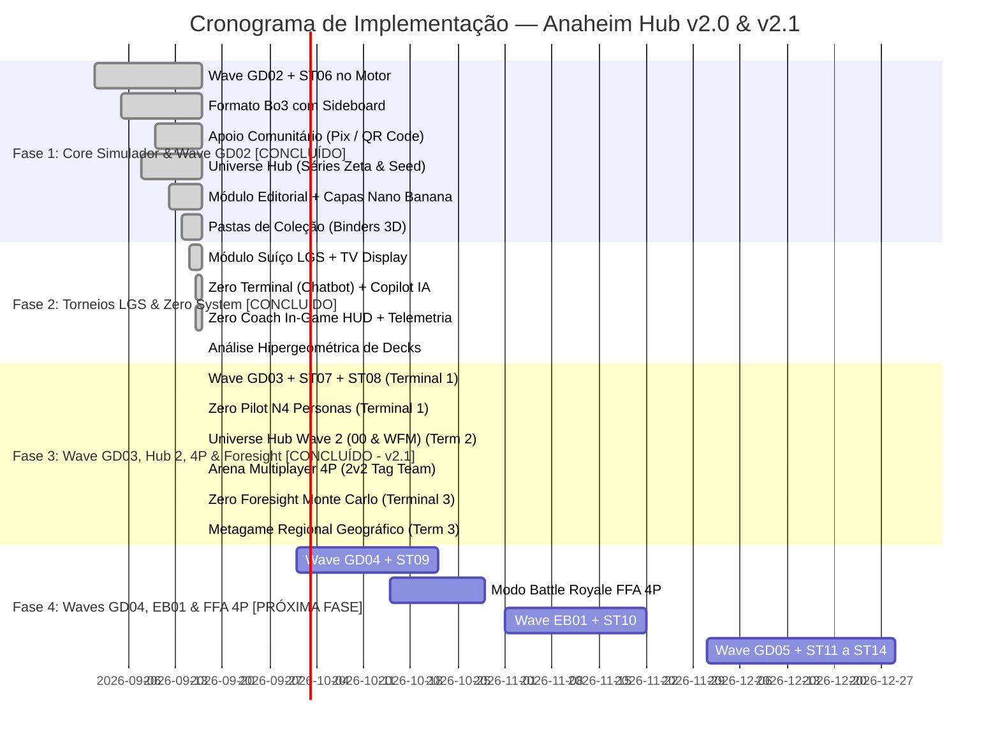

# Documento de Arquitetura e Plano Mestre — Evolução do Sistema & Zero System (v2.0)

> **Documento Canônico de Planejamento de Ciclos Futuros**  
> Data de Revisão: 2026-09-16 | Arquiteto & Engenheiro de Software: Willen, Antigravity & Claude CLI  
> Status: Aprovado Estrategicamente & Pronto para Execução Paralela  
> Referências: [docs/MANUAL_DESENVOLVIMENTO.md](MANUAL_DESENVOLVIMENTO.md), [AI_GUIDE.md](../AI_GUIDE.md), [PLANEJAMENTO.md](../PLANEJAMENTO.md), [prisma/schema.prisma](../prisma/schema.prisma)

---

## 1. Visão Executiva e Posicionamento do Produto

O **Portal Gundam TCG BR (Anaheim Hub)** consolidou com sucesso seu motor de jogo autoritativo, o catálogo nacional traduzido com terminologia oficial blindada, o deckbuilder analítico, o multiplayer em tempo real via Socket.io e a cobertura de regras até GD01 e ST05.

A versão **2.0** adota como prioridade máxima o **Simulador e o Deckbuilder**, expandindo o motor para cobrir as ondas de lançamentos (**GD02 a GD05 + Starters 06 a 14**), acompanhado da introdução do formato competitivo **Melhor de 3 (Bo3) com Sideboard**, **Multiplayer Real (2v2 / 4P)** e o ousado **ZERO SYSTEM**.

### Arquitetura de Execução Paralela Multi-Agente

Para maximizar a velocidade sem comprometer a estabilidade do motor de regras, o desenvolvimento opera em **worktrees isoladas (`git worktree`)** com especialização clara de agentes:

```
                               ┌────────────────────────────────────────────────────────┐
                               │             ORQUESTRAÇÃO MULTIAGENTE                   │
                               │        Willen (Lead) · Antigravity · Claude CLI        │
                               └──────────────────────────┬─────────────────────────────┘
                                                          │
                    ┌─────────────────────────────────────┴─────────────────────────────────────┐
                    │                                                                           │
       ┌────────────▼────────────┐                                                 ┌────────────▼────────────┐
       │     TERMINAL 1 (Core)   │                                                 │   TERMINAL 2 (Features) │
       │    MOTOR, REGRAS & IA   │                                                 │    FRONTEND & CONTEÚDO  │
       ├─────────────────────────┤                                                 ├─────────────────────────┤
       │ • Agente: Antigravity   │                                                 │ • Agente: Claude CLI    │
       │ • Branch: feature/gd02  │                                                 │ • Branch: feature/hub   │
       │ • Foco: Ingestão GD02,  │                                                 │ • Foco: Universe Hub,   │
       │   Engine, Bo3, Suíço,   │                                                 │   Editorial + Capas,    │
       │   Zero System & MCTS    │                                                 │   Pastas e Social       │
       └─────────────────────────┘                                                 └─────────────────────────┘
```

---

## 2. Pilar 1: Inclusão das Waves de Cartas Novas no Motor de Regras

### 2.1 Mapeamento das Ondas e Coleções

A expansão do motor obedecerá à governança estrita estabelecida no split de GD01 (`docs/MANUAL_DESENVOLVIMENTO.md §3` e `§4.3`), onde cada coleção é isolada em seu respectivo namespace dentro de `src/modules/simulator/content/` por cor e tipo, protegida por gates de cobertura (`deckCoverageGate.ts`) e suítes determinísticas (Golden Master).

| Onda | Coleções | Quantidade de Modelos Únicos | Status | Novas Mecânicas Previstas & Desafios de Motor |
|---|---|---|---|---|
| **Onda 6** | **GD02 + ST06 (+ ST05)** | ~147 cartas | **[CONCLUÍDO - v2.0]** | Auras globais, gatilhos de sacrifício encadeado, efeitos de Base, Sideboard Bo3 e 245 specs indexadas. |
| **Onda 7 (Prioritária)** | **GD03 + ST07 + ST08** | ~170 cartas | **[CONCLUÍDO - v2.1]** | Tokens auto-exilados ao sair do campo, Custo Alternativo de Deploy (sacrifice/discard/bounce), Dynamic Level/Cost, Zero Pilot N4 (Treize, Amuro, Char, Heero), 330 specs indexadas. |
| **Onda 8** | **GD04 + ST09** | ~150 cartas | [Planejado] | Ejeção de Piloto reativa durante combate, troca de Unidade em campo mantendo o Piloto acoplado (Transform / Mid-battle Swap). |
| **Onda 9** | **EB01 + ST10** | ~95 cartas | [Planejado] | Efeitos híbridos de cor dupla avançados, ativações no cemitério (Scrap/Graveyard triggers), restrições dinâmicas de ataque. |
| **Onda 10** | **GD05 + ST11 a ST14** | ~220 cartas | [Planejado] | Rotação e formato avançado, regras de temporada oficial Bandai, finalização do ciclo de expansões primárias. |

### 2.2 Protocolo de Engenharia para Novas Cartas

Cada carta segue obrigatoriamente o ciclo canônico de 5 etapas:

1. **Ingestão no Catálogo & RAG Translation**:
   - `scripts/import-card-set.mjs` ingere dados oficiais e gera `CardModel`.
   - `scripts/translate-card-effects.mjs` com RAG de terminologia (`docs/17`) gera `effectPt`, blindando tokens protegidos (`【Deploy】`, `<Blocker>`, `Lv.X`, `AP`, `HP`).
2. **Declaração de `CardDef` e `EffectSpec`**:
   - Fatiamento em `content/<set>/unitsBlue.ts`, `unitsGreen.ts`, `pilots.ts`, etc.
   - Nenhuma primitiva nova é criada sem registro no `primitives-claims.json`.
3. **TDD Atômico por Carta Complexa**:
   - Cartas com condições ou escolhas de alvo ganham testes dedicados em `content/<set>.test.ts`.
4. **Fuzzing Massivo de Self-Play**:
   - Execução de 1.000+ partidas simuladas (`pnpm gundam:fuzz`) garantindo zero loop infinito (`MAX_CASCADE_DEPTH=12`, `MAX_QUEUE_BREADTH=150`) e zero crash de estado.
5. **Atualização do Golden Master**:
   - Hash determinístico registrado com `pnpm gundam:golden:update`.

---

## 3. Pilar 2: O Novo ZERO SYSTEM (Evolução do Veda System)

O atual **Sistema VEDA** atua principalmente como um processador de telemetria estática (Power Rankings e gráficos). O **ZERO SYSTEM** (homenageando a interface tática do *Wing Gundam Zero*) evolui esse ecossistema para uma **IA Tática Multimodal, Multicamada e Hiper-Adaptativa**, suportada por uma arquitetura híbrida de modelos **Google Gemini (1.5 Flash / Pro)** e **Anthropic Claude (3.5 Sonnet / 3.7)**.

### 3.1 Arquitetura dos 5 Núcleos do Zero System

```
                     ┌──────────────────────────────────────────────────────────┐
                     │                       ZERO SYSTEM                        │
                     │          Inteligência Artificial Híbrida (Gemini+Claude) │
                     └─────────────┬──────────────┬──────────────┬──────────────┘
                                   │              │              │              │
           ┌───────────────────────┼──────────────┴──────────────┼──────────────└───────────────────────┐
           ▼                       ▼                             ▼                                      ▼
┌─────────────────────┐ ┌─────────────────────┐       ┌─────────────────────┐        ┌─────────────────────┐
│ 1. ZERO COPILOT     │ │ 2. ZERO COACH       │       │ 3. ZERO PILOT AI    │        │ 4. ZERO FORESIGHT   │
│ Deckbuilder Advisor │ │ In-Game Live HUD    │       │ Bot Multinível (4N) │        │ Previsão de Meta    │
├─────────────────────┤ ├─────────────────────┤       ├─────────────────────┤        ├─────────────────────┤
│ • Sugestões de Tech │ │ • Dicas de Ordem    │       │ N1: Recruta (Heur.) │        │ • Monte Carlo 10k   │
│ • Curva e Hiperg.   │ │ • Chance de Burst   │       │ N2: Ás (MCTS Poda)  │        │ • Simulação de Ban  │
│ • Diagnóstico Meta  │ │ • Alerta de Letal   │       │ N3: Zero Awakening  │        │ • Tier 1 Preditivo  │
│ • Substituições     │ │ • Análise Pós-Jogo  │       │ N4: Personas Piloto │        │   + Dados de Torneio│
└─────────────────────┘ └─────────────────────┘       └──────────┬──────────┘        └─────────────────────┘
                                                                 │
                                                      ┌──────────┴──────────┐
                                                      │ 5. ZERO TERMINAL    │
                                                      │ Chatbot Conversacion│
                                                      ├─────────────────────┤
                                                      │ • Lore & Estratégia │
                                                      │ • Rulings & Dúvidas │
                                                      │ • Atualizações Live │
                                                      └─────────────────────┘
```

#### 1. Zero Copilot (Deckbuilder AI) — **[CONCLUÍDO - v2.0]**
- **Localização**: Assistente lateral expansível no Hangar da OZ (`ZeroCopilotDrawer.tsx` no `DeckbuilderPage`).
- **Capacidades Implementadas**:
  - `POST /api/simulator/zero/deck/analyze`: Cálculo exato de distribuição hipergeométrica para turnos 1 a 3 (Unit Lv.1-2 e Pilotos).
  - Emissão de `consistencyScore` (0-100) com nota alfabética (`S`, `A`, `B`, `C`, `D`) e avisos de curva desbalanceada.
  - Recomendações contextuais de tech cards (Remoções, Blockers, Finishers, Recursos) por cor e arquétipo.
  - Botão de inspeção de carta com preview e adição de +1 cópia com 1 clique.

#### 2. Zero Coach (Live Match Assistant) — **[CONCLUÍDO - v2.0]**
- **Localização**: HUD tático expansível na Arena Asticassia (`ZeroCoachHud.tsx` no `SimulatorMatchPage`, com atalho de teclado `Z` e dock icon).
- **Capacidades Implementadas**:
  - **Burst Threat Matrix**: Probabilidade dinâmica (%) de o próximo escudo conter efeito `【Burst】`, rastreando cemitério, campo e base do oponente.
  - **Sequencing Advisor**: Alertas estratégicos pré-combate (ordem de comandos, remoção antes do ataque para desarmar blockers, timings de pareamento de Link Unit).
  - **Lethal Calculator**: Detecção em tempo real de `friendlyLethalReady` (letal ofensivo confirmado) e `enemyLethalImminent` (ameaça letal adversária).
  - 4 Personas Táticas ativas (Amuro, Char, Heero e Analista OZ).

#### 3. Zero Pilot AI (Bot Multinível com Contra-Estratégia Dinâmica)
Evolução do worker em `services/sim-bot/` e pipeline em `services/sim-trainer/`:
- **Nível 1 (Recruta)**: **[CONCLUÍDO]** Heurística rápida determinística com pequenas concessões de erro.
- **Nível 2 (Veterano / Ás)**: **[CONCLUÍDO]** Heurística pesada combinada com busca MCTS de profundidade com poda.
- **Nível 3 (Zero System Awakening)**: **[CONCLUÍDO]** Selecionador tático autônomo com self-play e suporte a GD01/GD02/ST01-ST06.
- **Nível 4 (Personas de Piloto — Montagem Dinâmica de Contra-Deck)**: **[CONCLUÍDO - v2.1]**
  - *Comportamento adaptativo inédito*: Ao selecionar a Persona, a IA analisa o deck escolhido pelo jogador humano e **monta em tempo real um deck sob medida** projetado para desafiar os pontos fracos daquela estratégia:
    - *Persona Amuro Ray*: Monta listas de Controle de Recursos e Midrange Reativo com remoções cirúrgicas e blockers de alto valor para neutralizar estratégias agressivas.
    - *Persona Char Aznable*: Monta listas de Alta Velocidade (Rush/Aggro vermelho), pressionando a Base antes que decks lentos consigam estabilizar.
    - *Persona Heero Yuy*: Monta listas focadas em demolição em massa (Wipe/Destruction), trocas implacáveis de unidades e cálculo exato de letal.
    - *Persona Treize Khushrenada*: Monta listas de Duelos Aristocráticos com Mobile Suits de elite (Xi Gundam, Penelope, Gundam Exia), priorizando o combate honroso de alto prestígio e elegância marcial.

#### 4. Zero Foresight (Previsão Preditiva de Metagame) — **[CONCLUÍDO - v2.1]**
- Simula em background 10.000 confrontos entre os arquétipos registrados no sistema a cada nova carta anunciada.
- Produz o índice de **Tier Shift**, definindo o **Tier 1** através da fusão entre a análise preditiva e os dados reais consolidados de top decks dos torneios.
- Endpoint de alta performance com cache de 10 minutos (`POST /api/simulator/zero/foresight/simulate`).

#### 5. Zero Terminal (Chatbot Tático & Conversacional) — **[CONCLUÍDO - v2.0]**
- **Localização**: Central `/zero` (`ZeroTerminalPage.tsx`) com atalhos e suporte global.
- **Capacidades Implementadas**:
  - `POST /api/simulator/zero/chat`: Motor RAG conversacional alimentado por `docs/17-glossario-traducao.md` e regras oficiais Bandai GCG.
  - Preservação estrita de terminologia em inglês (`Blocker`, `Burst`, `Link Unit`, `Breach`, `Repair`, `First Strike`, etc.) com explicações em pt-BR.
  - Suporte completo às 4 personas (Amuro Ray, Char Aznable, Heero Yuy e Estrategista da OZ).
  - Pipeline de fallback triplo resiliente: **Google Gemini 3.8 Flash** $\rightarrow$ **Claude 3.5 Sonnet** $\rightarrow$ **Motor Determinístico Local**.

---

## 4. Pilar 3: Universe Hub — Séries & Lore em Lançamento Sincronizado

Para valorizar a rica história da franquia Gundam e atrair fãs casuais e colecionadores, o portal ganha o **Universe Hub**, sincronizado com os lançamentos de cartas no motor.

### 4.1 Estrutura do Universe Hub (`/series` e `/series/:slug`)
Aproveitando a modelagem relacional já existente em `TaxonomyEntry (kind: SOURCE_TITLE)`:
- **Página da Série**:
  - Sinopse completa, cronologia na franquia (Universal Century, After Colony, Cosmic Era, Anno Domini, Ad Stella, Post Disaster).
  - Ficha técnica de Mobile Suits icônicos e Pilotos lendários.
  - Curiosidades de bastidores, citações famosas e temas musicais/aberturas.
  - **Grid de Cartas Relacionadas**: Exibição em tempo real de todas as cartas do catálogo vinculadas à série, com filtros por raridade e tipo.

### 4.2 Lançamento em Formato de Waves Sincronizadas
As páginas de séries serão liberadas acompanhando o momentum das coleções do TCG:
- **Wave GD02**: Destaque para *Mobile Suit Zeta Gundam* e *Mobile Suit Gundam SEED*.
- **Wave GD03**: Destaque para *Mobile Suit Gundam 00* e *Mobile Suit Gundam: The Witch from Mercury*.
- **Wave GD04**: Destaque para *Mobile Suit Gundam Wing* e *Iron-Blooded Orphans*.
- **Wave GD05**: Destaque para *Mobile Suit Gundam Hathaway* e *Char's Counterattack*.

---

## 5. Pilar 4: Módulo Editorial de Artigos (Content Hub) com Capas por IA

O schema do banco de dados já possui o modelo `Post` com campos maduros (`slug`, `contentMd`, `postType`, `galleryJson`, `youtubeUrl`). 

### 5.1 Experiência do Leitor (`/artigos`)
- **Feed Editorial**: Destaques visuais no topo, filtros por categoria (`NEWS`, `PREVIEW`, `REVIEW`, `GUIDE`, `TOURNAMENT_REPORT`).
- **Markdown Enriquecido com Card Engine**:
  - Sintaxe `[[GD01-001]]` ou `[[Gundam Calibarn]]`: renderiza hovercard tático interativo com arte, estatísticas e efeito em pt-BR/EN.
  - Sintaxe `[[deck:cuid_do_deck]]`: renderiza widget interativo de decklist dentro do texto com curva de custos e botão "Copiar para meu Hangar".
- **Tempo estimado de leitura, autor com avatar/bio e integração de galeria de imagens e vídeos**.

### 5.2 Painel Administrativo / CMS (`/admin/artigos`)
- Editor Markdown com live-preview split screen e renderização de sintaxe de cartas.
- **Gerador de Capas Automatizado (Nano Banana / AI Generator)**:
  - Sistema de geração de capas personalizadas no estilo conceitual Gundam de acordo com o tipo de artigo (ex: banner tático militar para torneios, arte blueprint para guias, cena épica espacial para notícias).
  - Curadoria e repositório de artes oficiais promocionais da Bandai/Sunrise prontas para uso.
- Upload drag-and-drop de imagens direto para o bucket do Supabase Storage.
- Sistema de rascunhos (`DRAFT`), revisão (`REVIEW`) e publicação agendada (`PUBLISHED`).

---

## 6. Pilar 5: Módulo Social, Pastas de Coleção & Customização Visual

### 6.1 Pastas de Coleção Públicas (Card Binders)
- Modelos `CardBinder` e `CardBinderItem` já existem no Prisma.
- **Interface Visual de Pasta**:
  - Modo Grid clássico e Modo "Fichário 3D" (estilo álbum físico de 9 ou 12 bolsos com animação tátil de virar página).
  - Tags de negociação por carta: **Disponível para Troca (Have)** e **Desejado / Busco (Want)**.
  - Link de compartilhamento direto da pasta (`/pastas/:shareId`) para negociações no WhatsApp/Discord.

### 6.2 Perfil Público do Piloto (`/piloto/:username`)
- Insígnias de Conquista: "Veterano da Batalha de Loum", "Top 8 Regional", "Criador de Conteúdo", "Apoiador Comunitário".
- Vitrine de Decks Criados com contadores de likes (`DeckLike`) e visualizações (`DeckView`).
- Histórico de participações em torneios presenciais e online.

### 6.3 Interações Sociais no Simulador & Customização
- **Radial de Emotes Táticos**:
  - Menu radial ao clicar no avatar do jogador: Emotes animados de Mobile Suits e balões de diálogo táticos:
    - *"Target Locked!"*, *"Sieg Zeon!"*, *"Entendido, iniciando missão!"*, *"Sensors Offline"*, *"Excelente jogada"*.
- **Lobby Chat e Pós-Jogo**:
  - Chat amigável na sala de desafio direto antes do início da partida.
  - Modal de "Aperto de Mão / GG" com opção de adicionar aos amigos ou solicitar revanche instantânea.
- **Modo Espectador**:
  - Jogadores podem assistir partidas públicas ou finais de torneio em tempo real com delay configurável de 30 segundos (anti-ghosting) e chat de torcida.
- **Skins, Sleeves e Playmats**:
  - Customização de fundos de mesa (Hangar Von Braun, Lua, Solomon, Side 7) e protetores de cartas (Federação, Zeon, Celestial Being, Tekkadan com shader foil).

---

## 7. Pilar 6: Sustentabilidade Financeira — Apoio Comunitário Inicial

### 7.1 Princípio Pétreo: Zero Pay-to-Win
O Gundam Card Game é propriedade intelectual da Bandai Namco. O Portal Gundam TCG BR é uma plataforma comunitária feita por fãs e para fãs. **Todas as cartas do catálogo, deckbuilder e 100% das funções mecânicas do simulador permanecerão eternamente gratuitas e irrestritas.** Nenhuma carta virtual será vendida por dinheiro real.

### 7.2 Fase Inicial: Apoio Comunitário via Pix / QR Code `[CONCLUÍDO - v2.0]`
Enquanto o ecossistema atinge maturidade de mercado, os modelos formais de assinatura serão postergados. A sustentabilidade imediata operará através de **Apoio Direto da Comunidade**:
- **Painel / Modal de Doações ("Manutenção do Hangar Anaheim")** (`DonateModal.tsx`):
  - Exibição de QR Code Pix e chave para contribuições voluntárias destinadas aos custos de servidor (Render Web Service), banco de dados (Supabase) e domínio.
  - Copiar chave Pix rápida com feedback visual, mural de apoiadores e badges de Patrono.
  - Acessível diretamente pelo cabeçalho superior e gaveta lateral de navegação em desktop e mobile.

---

## 8. Pilar 7: Módulo de Torneios Avançado, Suíço & Metagame Regional

O portal já conta com os alicerces de `Tournament`, `HostedEvent`, `HostedEventRound` e `DeckSnapshot`. A evolução atenderá às necessidades reais de torneios de lojas físicas (LGS) e ligas competitivas.

### 8.1 Motor de Pareamento Suíço Automático (Swiss System Engine) `[CONCLUÍDO - v2.0]`
- Algoritmo de emparelhamento baseado em vitórias/pontos (3 pts vitória, 1 pt empate, 0 derrota) implementado em `server/services/swissEngine.ts`.
- Prevenção automática de re-encontros (jogadores não se enfrentam mais de uma vez).
- Resolução de BYE automático para número ímpar de participantes.
- **Cálculo de Tie-Breakers Oficiais**:
  - `OMW%` (Opponent Match Win Percentage): força dos oponentes enfrentados.
  - `OGW%` (Opponent Game Win Percentage): porcentagem de jogos ganhos pelos adversários.
- Suporte a corte para Top Cut (Top 4 / Top 8 / Top 16) com chaveamento eliminatório visual e cálculo de standings.

### 8.2 Painel do Organizador de Loja (LGS Hoster HUD) `[CONCLUÍDO - v2.0]`
- **Display de Pareamento para TV da Loja** (`LgsTvDisplayPage.tsx` na rota `/admin/lgs-tv/:tournamentId`):
  - Modo fullscreen tático otimizado para projetores e TVs em lojas físicas.
  - Grid auto-ajustável com número da mesa, nomes dos pilotos, pontuação e status da partida.
  - **Timer de Rodada Integrado**: Relógio regressivo de 50 minutos com controle de Play/Pause, reset e avisos de rodada.

### 8.3 Metagame Regional Geográfico (Zero Local Intelligence) `[EM ANDAMENTO - FASE 3 / TERMINAL 3]`
Integrado ao Zero System, os dados de torneios cadastrados passam a ser categorizados por:
- `País` -> `Estado` -> `Cidade` -> `Loja Parceira`.
- **Relatórios Regionais do Zero System**:
  - *"Metagame SP Capital"*: 35% Blue Control, 28% Zeon Rush.
  - *"Metagame Sul (PR/SC/RS)"*: 40% Green Midrange, 22% White Wing.
  - O Zero System analisa as discrepâncias locais e avisa os jogadores: *"No circuito carioca, a presença de Blockers aumentou 22% nas últimas duas semanas; decks com cartas de remoção direta estão com 61% de winrate na região"*.

---

## 9. Inovações Estratégicas do Simulador: Formato Bo3 & Multiplayer 4P

### 9.1 Suporte a Partidas em Formato Melhor de 3 (Bo3) com Sideboard `[CONCLUÍDO - v2.0]`
- **Alinhamento Competitivo**: O jogo competitivo oficial e os Top Cuts de torneios operam no formato Bo3.
- **Fluxo de Sideboard no Simulador**:
  - Cada deck aceita até **10 cartas de Sideboard** cadastradas no Deckbuilder (`sideboardCards`).
  - Entre o Jogo 1 e o Jogo 2 (e Jogo 3, se houver), abre-se a interface tática `SideboardModal.tsx` com timer regressivo de 180 segundos.
  - Validação estrita de legalidade (o deck final deve manter exatamente 50 cartas principais respeitando o teto de 2 cores e 4 cópias).

### 9.2 Modos Multiplayer Reais (2v2 Tag Team e 4P Battle Royale) `[CONCLUÍDO - v2.1 / TERMINAL 2]`
- **Evolução da Rota `/simulador/multiplayer`**:
  - Implementada infraestrutura real de rede Socket.io com suporte a 4 assentos (`seatA`, `seatB`, `seatC`, `seatD`).
  - **Modo 2v2 Tag Team**: Duplas com escudos/bases cooperativas, bracket/lanes em tempo real e mini-radar tático flutuante.
  - **Lobby Inteligente**: Criação de esquadrão (`AR-XXXX`), sincronização de 4/4 pilotos prontos e transição automática ao combate.

---

## 10. Cronograma de Fases e Roadmap de Execução Paralela



---

## 11. Próximos Passos Imediatos de Execução (Fase 3 — Orquestração Multi-Agente)

1. **Terminal 1 — Core Engine & Zero Pilot N4 (Google Antigravity / Gemini)**:
   - Branch: `feature/wave-gd03-zeropilot` (baseada em `dev`).
   - Ingestão das specs GD03 + ST07 + ST08 e indexação no motor de combate.
   - Implementação de mecânicas de Tokens e Custo Alternativo de Deploy.
   - Implementação do Zero Pilot N4: gerador dinâmico de counter-decks adaptados às Personas (Heero Yuy, Char Aznable, Amuro Ray, Treize Khushrenada).

2. **Terminal 2 — Universe Hub Wave 2 & Arena Multiplayer 4P (Claude Code / Dev Frontend Sênior)**:
   - Branch: `feature/hub2-multiplayer4p` (baseada em `dev`).
   - Expansão do Universe Hub para as linhas temporais *Mobile Suit Gundam 00* (AD) e *Mobile Suit Gundam: The Witch from Mercury* (AS).
   - Conversão do mock `/simulador/multiplayer` em engine Socket.io funcional com suporte a 4 assentos (2v2 Tag Team e 4P FFA) com renderização de múltiplos playmats.

3. **Terminal 3 — Zero Foresight & Painel Metagame Regional (Dev Sênior Data/AI)**:
   - Branch: `feature/foresight-regional-meta` (baseada em `dev`).
   - Motor de simulação Monte Carlo (10.000 iterações em worker thread / pool) para projeção preditiva de Tier Shift baseada em taxas de conversão de Top Cut.
   - Painel geográfico de Metagame Regional com filtro por Estado/Cidade/LGS e alertas táticos de desvio padrão.
