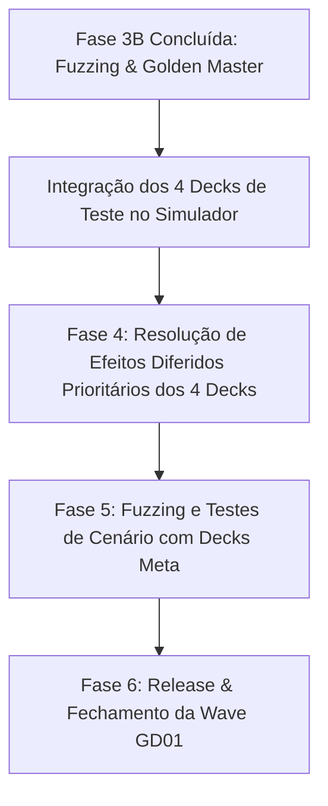

# Implementação dos 4 Decks de Teste GD01 e Atualização do Seletor de Decks no Simulador

Este plano define a criação dos 4 decks de meta inicial da era ST01-04 + GD01 identificados a partir das imagens fornecidas pelo usuário, a substituição dos botões de Starter Decks por um componente `Select` agrupado e estilizado nas telas do simulador, e o planejamento detalhado das próximas fases da Wave GD01.

---

## 1. Decks Transcritos e Validados

Todos os 4 decks foram conferidos carta a carta contra `ALL_CARD_DEFS` e validados pelo motor de regras (`computeDeckLegality`):
- **Exatamente 50 cartas** no deck principal + **10 recursos** no deck de recursos.
- **Máximo de 2 cores** permitidas pelas regras oficiais.
- **Máximo de 4 cópias** por código de carta.

### 1. Wing Blockers (GD01) — Branco / Verde
- **Cores**: Branco (White) + Verde (Green)
- **Composição**:
  - Unidades: Zowort (`ST01-009`) x3, Gundam Lfrith (`GD01-086`) x4, Launcher Strike Gundam (`GD01-072`) x1, Sword Strike Gundam (`GD01-073`) x3, Aile Strike Gundam (`ST04-001`) x4, Gundam Deathscythe (`GD01-025`) x3, Wing Gundam (`ST02-001`) x4, Wing Gundam Zero (`GD01-024`) x4.
  - Pilotos: Duo Maxwell (`GD01-090`) x3, Heero Yuy (`ST02-010`) x3, Kira Yamato (`ST04-010`) x4.
  - Comandos: Hawk of Endymion (`ST04-013`) x1 (Modo piloto: Mu La Flaga), Overflowing Affection (`GD01-118`) x4, Unforeseen Incident (`ST01-014`) x2, Striker Pack (`ST04-012`) x3.
  - Bases: Underground Desert Base (`GD01-126`) x4.

### 2. OYW (GD01) — Azul / Verde
- **Cores**: Azul (Blue) + Verde (Green)
- **Composição**:
  - Unidades: GM (`ST01-005`) x4, Guntank (`GD01-008`) x4, Zaku II (`ST03-008`) x4, Zaku II (`GD01-035`) x4, Char's Zaku II (`GD01-026`) x4, Char's Zaku II (`ST03-006`) x4, Rick Dom (`GD01-030`) x4, Anksha (`GD01-020`) x4, Gundam (`ST01-001`) x4, Char's Gelgoog (`GD01-023`) x1.
  - Pilotos: Char Aznable (`ST03-011`) x4, Amuro Ray (`ST01-010`) x4.
  - Comandos: A Show of Resolve (`GD01-100`) x1.
  - Bases: Corsica Base (`ST02-016`) x4.

### 3. Unicorn Blockers (GD01) — Branco / Azul
- **Cores**: Branco (White) + Azul (Blue)
- **Composição**:
  - Unidades: Zowort (`ST01-009`) x3, Gundam Lfrith (`GD01-086`) x3, Gundam (`ST01-001`) x4, Launcher Strike Gundam (`GD01-072`) x2, Perfect Strike Gundam (`GD01-068`) x1, Aile Strike Gundam (`ST04-001`) x4, Unicorn Gundam (Unicorn Mode) (`GD01-005`) x2, Freedom Gundam (`GD01-065`) x2, Unicorn Gundam (Destroy Mode) (`GD01-002`) x2.
  - Pilotos: Amuro Ray (`ST01-010`) x4, Kira Yamato (`ST04-010`) x4, Banagher Links (`GD01-088`) x4.
  - Comandos: Overflowing Affection (`GD01-118`) x4, Unforeseen Incident (`ST01-014`) x1, Striker Pack (`ST04-012`) x2, A Show of Resolve (`GD01-100`) x3.
  - Bases: Archangel (`ST04-015`) x2, White Base (`ST01-015`) x3.

### 4. Newtype Ping (GD01) — Azul / Vermelho
- **Cores**: Azul (Blue) + Vermelho (Red)
- **Composição**:
  - Unidades: GINN (`ST04-008`) x2, GM (`ST01-005`) x4, Guntank (`GD01-008`) x4, Guncannon (`GD01-004`) x3, ReZEL (`GD01-018`) x4, Anksha (`GD01-020`) x4, Gundam (`ST01-001`) x4, Kshatriya (`GD01-044`) x4, Unicorn Gundam 02 Banshee (Destroy Mode) (`GD01-003`) x2.
  - Pilotos: Sayla Mass (`GD01-087`) x2, Amuro Ray (`ST01-010`) x4, Marida Cruz (`GD01-093`) x4.
  - Comandos: Battle of Aces (`GD01-111`) x2, A Show of Resolve (`GD01-100`) x3.
  - Bases: Vesalius (`ST04-016`) x4.

---

## 2. Proposed Changes

### Fixtures e Definições de Decks

#### [NEW] [gd01TestDecks.ts](file:///c:/WillenWorks/portal-gundam-tcg-br/src/modules/simulator/fixtures/gd01TestDecks.ts)
- Construtores tipados `buildWingBlockersDeckList()`, `buildOywDeckList()`, `buildUnicornBlockersDeckList()`, `buildNewtypePingDeckList()`.
- Exporta objeto unificado `GD01_TEST_DECKS` com IDs estáveis:
  - `GD01-WING`: "Wing Blockers (GD01)"
  - `GD01-OYW`: "OYW (GD01)"
  - `GD01-UNICORN`: "Unicorn Blockers (GD01)"
  - `GD01-PING`: "Newtype Ping (GD01)"

#### [NEW] [gd01TestDecks.test.ts](file:///c:/WillenWorks/portal-gundam-tcg-br/src/modules/simulator/fixtures/gd01TestDecks.test.ts)
- Testes automatizados verificando que os 4 decks possuem exatamente 50 cartas + 10 recursos, passam na legalidade de cores/cópias e usam cartas presentes no catálogo.

---

### Backend do Simulador

#### [MODIFY] [server/index.ts](file:///c:/WillenWorks/portal-gundam-tcg-br/server/index.ts)
- Adicionar os 4 novos decks em `SIMULATOR_DECKS` e na resolução de decks de treino (`resolveDeckForTraining`).
- Isso garante suporte imediato tanto na Fila Online e Desafios PvP (`/simulador`) quanto no Treino Solo contra o Bot (`/simulador/treino`).

---

### Interface do Usuário (UI)

#### [MODIFY] [SimulatorSandboxPage.tsx](file:///c:/WillenWorks/portal-gundam-tcg-br/src/pages/SimulatorSandboxPage.tsx)
- Substituir o bloco de botões de STs (`DECK_OPTIONS.map((option) => <button>...`) por um `<Select>` Shadcn UI estilizado com visual de cockpit espacial / Asticassia:
  - Grupo 1: Starter Decks Oficiais (`ST01`, `ST02`, `ST03`, `ST04`).
  - Grupo 2: Decks de Teste GD01 (`Wing Blockers (GD01)`, `OYW (GD01)`, `Unicorn Blockers (GD01)`, `Newtype Ping (GD01)`).

#### [MODIFY] [SimulatorTrainingPage.tsx](file:///c:/WillenWorks/portal-gundam-tcg-br/src/pages/SimulatorTrainingPage.tsx)
- Adicionar o grupo de "Decks de Teste GD01" no `<SelectContent>` do deck do jogador e do bot, permitindo simulações e treinos cruzados.

---

## 3. Planejamento para os Próximos Passos (Wave GD01)

Com a Fase 3B (Fuzzing 4500 partidas, Golden Master seeds 11-15, Coverage Gate 0 faltando) concluída pelo Claude e os 4 Decks de Teste configurados na interface:

1. **Passo I (Esta etapa)**: Cadastrar os 4 Decks de Teste e modernizar a seleção de decks no simulador (Select Box).
2. **Passo II (Fase 4 - Desrepressão de Efeitos Diferidos Prioritários)**:
   - Os 4 decks contêm cartas-chave que atualmente estão em `deferred.ts`:
     - `GD01-024 Wing Gundam Zero`: Dano em área em unidades Lv.5 ou menor.
     - `GD01-044 Kshatriya`: Dano dividido em 1 a 2 unidades inimigas ao parear Newtype.
     - `GD01-090 Duo Maxwell`: Proteção contra redução de AP por efeitos inimigos.
     - `GD01-002 Unicorn (Destroy Mode)` & `GD01-005 Unicorn (Unicorn Mode)`: Alternância de modo e resgate de piloto.
     - `GD01-003 Banshee (Destroy Mode)`: Reciclagem de trash para deck.
   - Implementaremos as primitivas faltantes no motor para tirar essas cartas de `deferred.ts` e transformá-las em `implementada`.
3. **Passo III (Fase 5 - Fuzzing com os Decks Meta)**:
   - Rodar partidas automáticas entre os 4 decks de teste (Wing vs OYW, Unicorn vs Ping, etc.) com bot heurístico para certificar que os novos efeitos interagem sem falhas nem impasses.
4. **Passo IV (Fase 6 - Fechamento & Manifest)**:
   - Atualizar `gd01.manifest.json` para `RELEASE_READY` e congelar a wave.

---

## 4. Verification Plan

### Automated Tests
- `npx vitest run src/modules/simulator/fixtures/gd01TestDecks.test.ts`
- `npx vitest run src/modules/simulator/content/validatedDecks.test.ts`
- `pnpm tsc --noEmit`

### Manual Verification
- Acessar `/simulador` no navegador via browser subagent.
- Verificar que os botões antigos de ST desapareceram e deram lugar ao novo `<Select>` estilizado.
- Abrir o dropdown e confirmar que as opções exibem:
  - ST01, ST02, ST03, ST04
  - Wing Blockers (GD01)
  - OYW (GD01)
  - Unicorn Blockers (GD01)
  - Newtype Ping (GD01)
- Selecionar um dos decks e verificar persistência visual e funcional.
